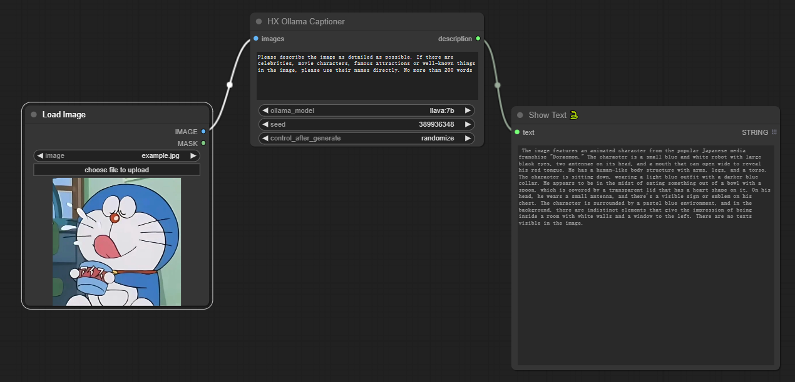

# ComfyUI-HX-Captioner

自定义 ComfyU I节点，用于通过 Ollama Python 客户端与 Ollama 服务器交互。需确保 Ollama 服务器运行中且可从ComfyUI 主机访问

## 配置文件
 
配置文件在 etc/config.json，字段如下：

- ollama_models：Ollama 已安装模型名称列表
- ollama_url： Ollama 服务的访问地址

```
{
    "ollama_models":["llama3.2-vision","llava"],
    "ollama_url":"http://127.0.0.1:11434"
}
```

## 样例

